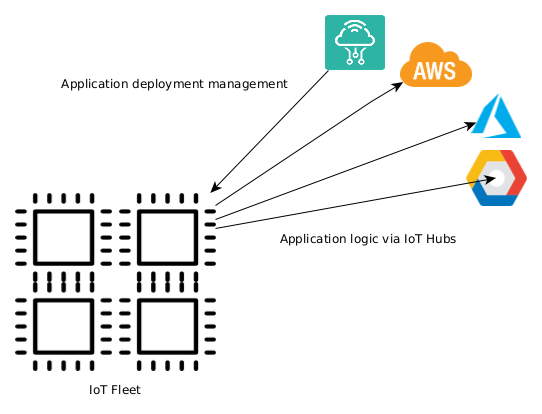
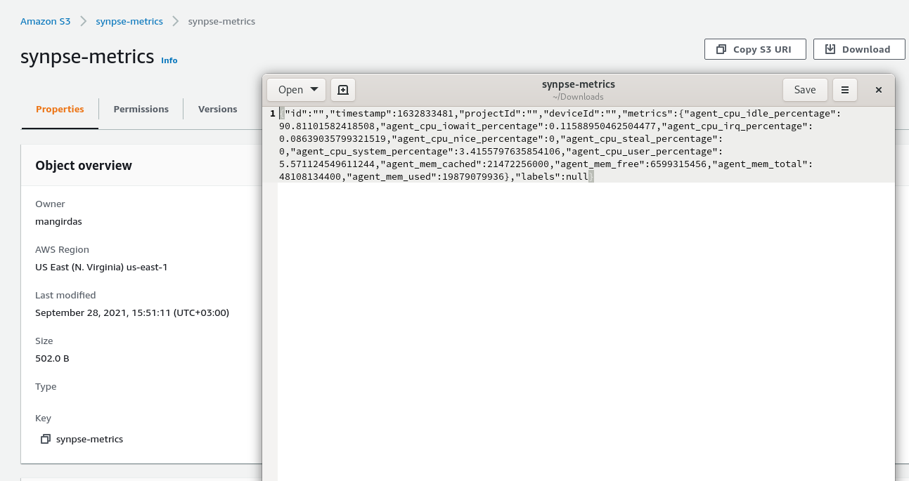

# AWS IoT Core Synpse example

AWS IoT Core example contains IoT application example for AWS public cloud integration

Synpse is not competing with any of the Public Cloud offerings. Contrary - it adds value ontop.

Most public cloud providers gives users a framework to interact with their devices and consume their data.
It is very much `SAAS` layer product. Where `Synpse` allows you to manage devices in the lower layers, more like a `PAAS`.

Working together with public cloud offerings you can create bespoke architectures.

Cloud providers mostly provides "IoT hubs" for data ingestion and application layer interactions via MQTT. This allows 
application layer integration. For the embedded applications this is fine when application are part of hardware. But in the 
"age of containers" we are used to packaging application outside of hardware and iterate on both independently.

This is where Synpse comes in. It allows deploy and interact with your application as deployments. This way you can decouple your 
application logic from hardware.


# AWS IoT Core

For this application to work we need to setup AWS IoT Core and its pre-requisites. 

AWS uses certificate authentication.

1. Create a "thing"

```
aws iot create-thing --thing-name synpse

{
    "thingName": "synpse",
    "thingArn": "arn:aws:iot:us-east-1:xxxxxxxxxxxxxx:thing/synpse",
    "thingId": "d1f846a7-aee9-46da-8a45-2xxxxxxxxxxxxx"
}
```

2. Create policy for all devices

```
aws iot create-policy --policy-name synpse-policy --policy-document file://assets/aws_iot_queue.policy
```

3. Create certificate for your thing. AWS are very "user friendly" so we call our friend JQ to the help too.
```
aws iot create-keys-and-certificate \
    --set-as-active \
    --certificate-pem-outfile  certificate.pem \
    --public-key-outfile certificate.pub \
    --private-key-outfile certificate.key > certificate.json

cat certificate.json | jq -r .certificatePem > certificate.pem
cat certificate.json | jq -r .keyPair.PublicKey > certificate.pub
cat certificate.json | jq -r .keyPair.PrivateKey > certificate.key
```

4. List current certificates

```
aws iot list-certificates
```

5. Attach policy to certificate (use ARN certificate value)

```
aws iot attach-policy --policy-name synpse --target arn:aws:iot:us-east-1:632962303439:cert/xxxxxxxxxxxxxxxxxxxxxxxxxxxxxx
```

6. Attach thing to certificate

```
aws iot attach-thing-principal \
    --principal arn:aws:iot:us-east-1:632962303439:cert/xxxxxxxxxxxxxxxxxxxxxxxxxxxxxxxxxxxxxx \
    --thing-name synpse
```

7. Download AWS root CA from: https://docs.aws.amazon.com/iot/latest/developerguide/server-authentication.html


8. Get thing endpoint
```
aws iot describe-endpoint
{
    "endpointAddress": "xxxxxxx.iot.us-east-1.amazonaws.com"
}
```

Note: If you get `AWS_IO_TLS_ERROR_NEGOTIATION_FAILURE`, change endpoint to xxxxx-ats.iot.....
https://github.com/aws/aws-iot-device-sdk-python-v2/issues/52 


9. Create S3 bucket for our metrics. This can be any other destination of your choice
```
aws s3api create-bucket --bucket synpse-metrics --region us-east-1
```

10. Destination configuring and setting via CLI is bit flaky and CLI V2 throws few random errors (nothing new on AWS...)
It is easier to do this via UI:

Click `Act -> Rules -> Create Rule`

* Name: `synpse-s3`
* Query: `test/topic`
* Add Action -> S3 Bucket. Select our S3 bucket, and Create Role for this.


# Deploy application

Create synpse secret with certificates:

```
synpse secret create aws-cert --file certificate.pem
synpse secret create aws-key --file certificate.key
synpse secret create aws-root-ca --file AmazonRootCA1.pem
```

Deploy Synpse application. Modify application yaml with your thing endpoint.

```
synpse deploy -f synpse-aws-example.yaml
```

Once running, you should see application running and data coming into AWS S3 account




# WTF's

1. CLI was a disaster 5 years ago, it still is.

2. Final steps of configuring rules is so ambiguous you need to click UI as CLI errors are crazy nonsense

3. Focus on UI clicking over CLI is bit too much for my personal taste :)